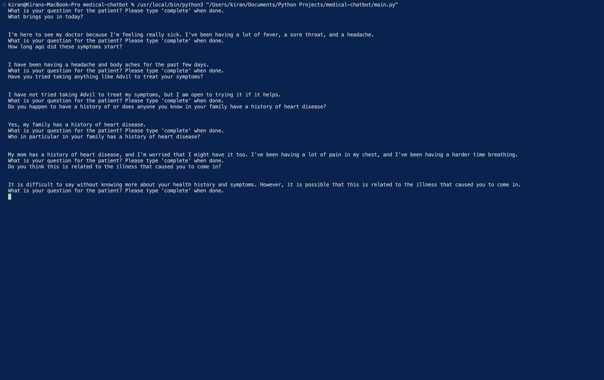

# medical-chatbot
> Basic prototype chatbot for doctor patient interview training.

## Table of Contents
* [General Info](#general-information)
* [Technologies Used](#technologies-used)
* [Screenshots](#screenshots)
* [Setup](#setup)
* [Usage](#usage)
* [Limitations](#limitations)
* [Project Status](#project-status)
* [Acknowledgements](#acknowledgements)
* [Contact](#contact)

## General Information
This chatbot simulates a patient during a doctor patient interview. The program converts the user's speech to text and then responds as if a patient during an examination with a doctor. 

## Technologies Used
- Python
- Whisper
- text-curie-001
- wave
- tkinter

## Screenshots

## Setup
Ensure the neccessary libraries have been installed prior to execution. 

## Usage
Begin by running main.py. Next, in the GUI press the record button and begin speaking to the chatbot. When done, press the record button once again and return to the console to view the bot's response. After the bot has responded repeat the process above. Once the conversation is finished say 'complete' and the program will end. 

## Limitations
Chatbot tends to get derailed after about 5-6 responses. This may be due to the fact that the information given to the chatbot regarding each scenario was limited.

## Project Status
Project is: _complete_

## Acknowledgements
Give credit here.
- This project was completed as part of undergraduate research for AI for Physician Patient Interviewing at the University of Arizona.

## Contact
Created by [@KiranSmelser](https://github.com/KiranSmelser) - please feel free to reach out and contact me!
